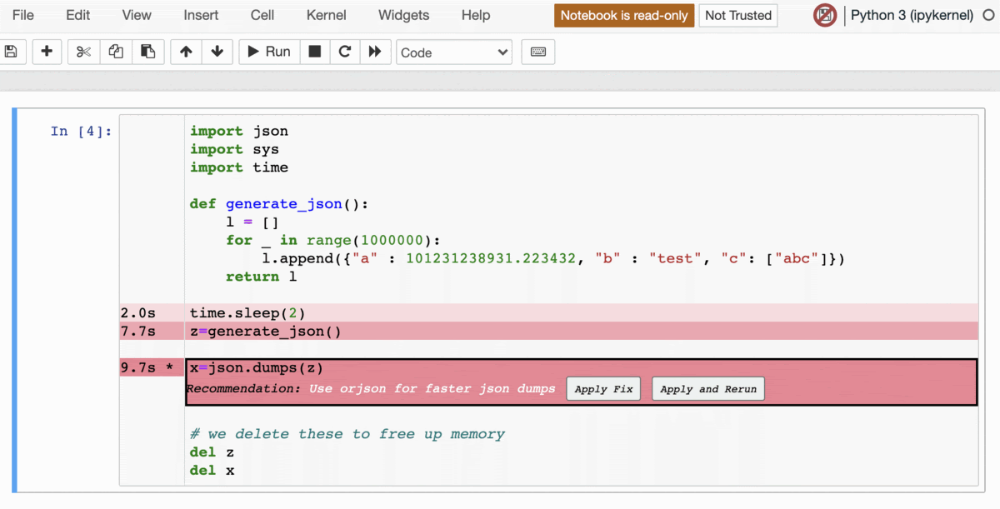

# Introduction

WhyProfiler is a CPU profiler for Jupyter notebook that not only identifies hotspots but can suggest faster alternatives. It is powered by [Semgrep](https://semgrep.dev/) and [yappi](https://github.com/sumerc/yappi) and implemented as Jupyter Notebook extension.

It is also the only Python profiler that both identifies hotspots and recommends equivalent code that can fix them.



See the release blog post for more information.

# Building and running

The easiest way to use whyprofiler is to run it as a Docker container. The container includes both Jupyter Notebook as well as the whyprofiler extension for Jupyter notebook, preconfigured.

```bash
docker build . -t whyprofiler
docker run -p 8888:8888 whyprofiler
```

**TODO: add prebuilt docker images so people don't need to build it themselves**

We don't yet support M1 Macbooks. If you have an M1 Macbook please build an amd64 version of the image instead:

```bash
docker build --platform linux/amd64 . --progress=plain -t whyprofiler
```

# Adding new rules to whyprofiler
Add a new file with a Semgrep rule to ./whyprofiler/static/semgrep/

You can look at the existing rules for reference. 

Some rules requires installing python packages in order to apply the fix. You can add the `fix_installation` field to Semgrep metadata to do so. [See example.](https://github.com/aantn/nprofile/blob/master/whyprofiler/static/semgrep/use_orjson.yaml#L12)
